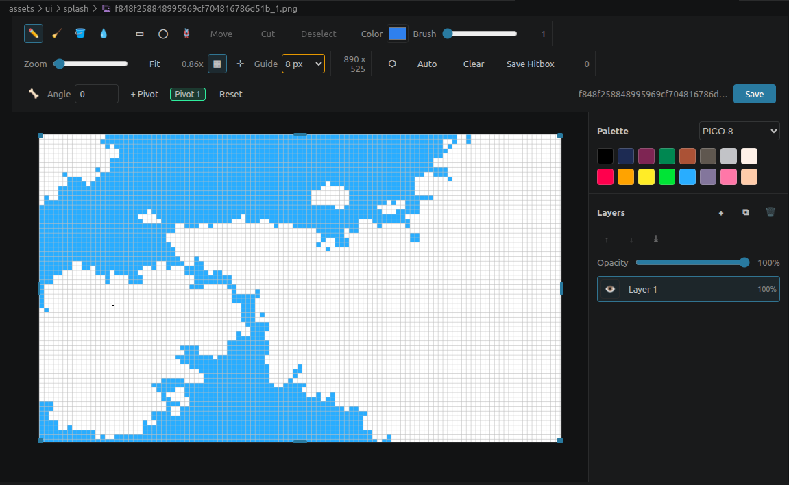

# Pixel VSCode

A full-featured pixel art editor that runs right inside VS Code — draw, rig, build collision hitboxes, preview animations, and export native tile maps for Godot, all without leaving the editor you already code in.



## Why Pixel VSCode?

- **No tool-switching.** Open a PNG straight inside VS Code with a built-in custom editor — no need to reach for Aseprite, Photoshop, or GIMP for a quick sprite edit.
- **A real pixel-art editor, not just an image viewer.** Layers, pivot/bone rigging, collision hitboxes, and grid snapping — capabilities usually reserved for dedicated pixel-art software.
- **Deep Godot integration.** Export `ConvexPolygonShape2D` hitboxes and native `.tscn` tile maps directly — the sprites and maps you draw are ready to use in your game with no intermediate conversion step.
- **Safe by default when saving.** Never silently overwrites your original file; you always get a choice to save a copy instead.
- **Nothing is lost between sessions.** Layers, opacity, rig, and hitbox state are all persisted to a sidecar file, so you can close the editor and resume exactly where you left off.
- **Lightweight, no external services.** No account, no network calls, works fully offline with a single runtime dependency (`pngjs`).

## Highlighted features

### 1. Drawing and editing
- **Pencil, Eraser, Fill (bucket), Color picker** tools with an adjustable brush size from 1–64 px.
- **Keyboard shortcuts for tool switching**: `P` Pencil, `E` Eraser, `B` Fill, `I` Color picker, `R` Rectangular selection, `O` Ellipse selection, `L` Lasso selection, `H` Hitbox, `G` Rig — press the key while the canvas has focus to switch instantly, no need to reach for the toolbar.
- Built-in color palettes: **PICO-8, Game Boy, DawnBringer 16, AAP-16** — pick colors instantly without hunting for an external swatch.
- Toggleable **guide grid snapping** with step sizes of 1, 8, 16, 32, 64, or 128 px, for pixel-perfect drawing aligned to tiles or sprite scale.
- **Smooth zoom** (0.1x–40x) via slider or Ctrl+Scroll that keeps the cursor position anchored, plus a **Fit to screen** button to instantly frame the canvas.

### 2. Powerful selection tools
- Three selection shapes: **Rectangular, Ellipse, Lasso (freehand)**.
- **Staircase polygon selection**: when snap-to-grid is enabled, ellipse and lasso selections are automatically "staircased" to the pixel grid (using an orthogonal boundary-tracing / Pavlidis-style algorithm), producing crisp, pixel-accurate selections instead of smooth curves that don't align to the grid.
- **Move**, **Cut**, or **Copy** the selected content, with grid snapping while dragging.
- A "marching ants" overlay clearly shows the active selection at any zoom level.

### 3. Full layer system
- Add, duplicate, delete, reorder, **merge down**, and set per-layer **opacity**.
- **Import images as new layers**: pick one or more image files and drop them straight in as layers, automatically named after the source file.
- **Copy/paste layers and selections between files**: copy a layer or a selection in one Pixel Editor tab and paste it into another open PNG — the pasted content lands as a new layer (or a movable floating selection), so you can quickly reuse art across sprites in the same VS Code session.
- **Export sprite sheet**: composites every currently visible layer into a single grid-atlas PNG (one cell per layer, laid out in the smallest square-ish grid) — handy for turning layered poses/frames into one texture.
- Show/hide layers independently, rename layers directly in the panel.
- The entire layer structure (order, opacity, rig, visibility) is saved to a `.pixvjson` sidecar file next to the PNG and automatically restored on reopen — no need to rebuild it from scratch.

### 4. Rigging — pose sprites with pivots
- Attach multiple **pivot points** to a layer and rotate each one using an on-canvas rotation handle.
- Rotation angle can **snap to whole degrees** for easy symmetric or repeatable poses.
- Once you're happy with a pose, **flatten** the layer to bake the transform into real pixels.
- Great for posing characters or prototyping simple skeletal animation directly on a static sprite.

### 5. Hitbox / collision shapes for games
- Draw a hitbox polygon by hand directly over the sprite, or let the **auto-trace convex hull** tool detect the boundary from the opaque pixels automatically.
- Save the result as a `ConvexPolygonShape2D` file (`<filename>.collision.tres`) next to the PNG — ready to import directly into Godot as a `CollisionShape2D`.
- Edit or clear hitbox points at any time without affecting the sprite's pixels.

### 6. Visual canvas resizing
- Drag handles on any of the 4 edges or 4 corners to resize the canvas in real time — no manual dimension entry required.

### 7. Animation preview from PNG sequences
- **Pixel: Preview PNG Animation** command: select at least two PNG files (from the Explorer or a file picker) to play them back as an animation.
- Set **one shared duration for all frames** or **a custom duration per frame**.
- Preview plays right inside a dedicated VS Code panel — no need to export a GIF or use an external tool just to check your animation.

### 8. Pixel Map Editor — tile maps built for Godot
- Create a streaming-friendly map source with **Pixel: New Pixel Monster Map**, setting a map/chunk id and cell dimensions (`32x32` is the recommended streaming chunk size).
- Paint, erase, and fill across multiple **map layers**, using tiles pulled directly from any `TileSetAtlasSource` declared in a Godot `.tres` TileSet.
- The `.pixelmap.json` file is kept only as the editor source — when ready, run **Export .tscn** to generate a native Godot scene (`scenes/world/maps/<map_id>.tscn`) with serialized `TileMapLayer` cell data, produced headlessly through a configurable Godot executable (`pixelVscode.godotExecutable`).

### 9. Safe saving — no accidental data loss
- On save, if the PNG on disk wasn't created by the current editing session, you're always asked first: **Overwrite** the original, or **Save as new file** (a copy that opens automatically in the editor).

## Commands (Command Palette)

| Command | What it does |
|---|---|
| `Pixel: New Pixel Image` | Create a new blank pixel art PNG |
| `Pixel: Open With Pixel Editor` | Open a PNG/JPG with the Pixel Editor |
| `Pixel: Preview PNG Animation` | Combine multiple PNGs into an animation preview |
| `Pixel: New Pixel Monster Map` | Create a new tile map source for a Godot project |

The editor and animation preview commands also appear in the Explorer right-click menu and in the editor title bar context menu for `.png`, `.jpg`, and `.jpeg` files.

## Pixel editor layout

| Section | Controls |
|---|---|
| Tools | Pencil (P), Eraser (E), Fill (B), Color picker (I) |
| Selection | Rectangular (R), Ellipse (O), Lasso (L) — with Move, Cut, or Copy |
| Brush | Color picker, brush size (1–64 px) |
| View | Zoom slider, Fit button, grid toggle, snap toggle, guide size |
| Hitbox (H) | Edit hitbox points, Auto-trace, Clear, Save Hitbox |
| Rig (G) | Select pivot, set angle, add pivot, reset rig |
| File | Status, Save |

The side panel manages **Layers** (add/delete/duplicate/import image/copy/paste/export sprite sheet/opacity) alongside the built-in color **Palette**.

## Save behavior

When you save, if the PNG on disk wasn't created by the editor in the current session, a dialog asks you to choose between **Overwrite** (replace the original) or **Save as new file** (save a copy). Saving as a new file automatically opens that copy in the editor for continued editing.

## Pixel maps — Godot workflow

Run `Pixel: New Pixel Map` while a Godot project folder is open:

1. Enter a map/chunk id and cell dimensions. `32x32` is the recommended streaming chunk size.
2. Select a TileSet located under `assets/tiles`.
3. Paint across multiple map layers using the Paint, Erase, and Fill tools.
4. Save the editable `.pixelmap.json` source.
5. Choose **Export .tscn** to generate `scenes/world/maps/<map_id>.tscn`.

JSON is retained only as editor source. The game-ready output is a native Godot scene with serialized `TileMapLayer` cell data.

Configure `pixelVscode.godotExecutable` if the Godot binary isn't available in your PATH under the name `godot`.

## Configuration

| Setting | Default | Description |
|---|---|---|
| `pixelVscode.godotExecutable` | `godot` | Godot executable used to export native map scenes |

## Requirements

- VS Code `^1.90.0` or later.
- Godot (optional) — only needed when exporting a `.pixelmap.json` map to `.tscn`.

## Development

```sh
npm install
npm run compile
npx @vscode/vsce package
```

Press `F5` in VS Code to launch an Extension Development Host.

| Script | Purpose |
|---|---|
| `npm run compile` | Compile TypeScript to `out/` |
| `npm run watch` | Watch mode compilation |
| `npm run check` | Type-check without emitting |
| `npm run package` | Production build (esbuild + tsc) before packaging the `.vsix` |

## License

MIT — see [LICENSE](LICENSE).
